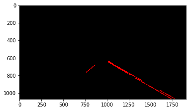

# **Finding Lane Lines on the Road** 

_Author: Sebastian Brannstrom_

## Project description

**Finding Lane Lines on the Road**

The goals / steps of this project are the following:
* Make a pipeline that finds lane lines on the road
* Reflect on your work in a written report

### Work
Please see the [Jupyter notebook](P1.ipynb).

### Reflection

### 1. Describe your pipeline. As part of the description, explain how you modified the draw_lines() function.

My pipeline consisted of 9 steps. 

1. Read frame from video into still image
1. Convert image to grayscale
1. Blur image slightly to reduce noise
1. Run Canny edge detection
1. Cut out area of interest based on camera viewpoint
1. Apply Hough line detection
1. Group line segments based on angle and position into "extended lines"
1. Collect extended lines over N frames
1. Draw the maximum extended line from the set of N lines

The best Canny edge detected was produced with a blur `kernel_size=11` and then applying a `low_threshold=100` and `high_threshold=200`. This seems to work alright for yellow lines as well.

The Hough transform parameters were tricky to get right, but `rho=3`, `theta=3*np.pi/180`, `threshold=30`, `min_line_length=100` and `max_line_gap=50` work alright, except that it sometimes believes white cars to be part of the lane lines.

The lines created by this process generally track segments of lane markings, but as the desired end result is a solid boundary line no matter the lane pattern, we need to aggregate these segments into one contiuous line per side of the lane before we call `draw_lines`.

To accomplish this I apply a primitive aggregation algorithm

1. Collect line segments into left and right groups based on their slope and position in the image.
1. Find the maximum and minimum X and Y axis extensions of the entire set of segments. This is the aggregated output line.

Below are before and after videos for this aggregation process

This process gives us a single longest spanning line per side of the lane. However, since lane lines are often dashed, if we want to produce a line spanning the entire lane for a video, we need to aggreate this over a series of frames as the lane marking moves across our viewport.

To do this, we simply apply the same aggregation process as above across a series of frames in the video, taking the resulting lines for each frame and storing them in a buffer from which we extract a single new line per frame. This provides a sort of moving average, which works well for our purposes.

Here is an example still from the `challenge.mp4` video with a buffer of 10 frames

The processed videos are available for download here
* [solidWhiteRight.mp4](images/solidWhiteRight.mp4?raw=true)
* [solidYellowLeft.mp4](images/solidYellowLeft.mp4?raw=true)
* [challenge.mp4](images/challenge.mp4?raw=true)

### 2. Identify potential shortcomings with your current pipeline

The tracking is highly dependent on contrast. Brightness levels, road material and lane indicator wear might decrease contrast enough to make the edge detection fail. This is visible in the challenge video, where the canny edge detection fails for many frames, causing the entire pipeline to fail temporarily.

Another problem is obstruction by other vehicles on the road. If the markings aren't visible at all because a large truck is hiding the view, then we would easily lose track of the markings.

The maximum extent finding system is pretty primitive too, so if a car is obstructing dashed lane markings a bit ahead we would miss out on those segments.

### 3. Suggest possible improvements to your pipeline

To deal with the contrast problems we probably should be making use of dynamic coefficients for our Canny and Hough algorithms.

There are substantially better filtering techniques that can be applied to the raw data produced by Hough, including statistical means and probably better heuristics than what I use.
